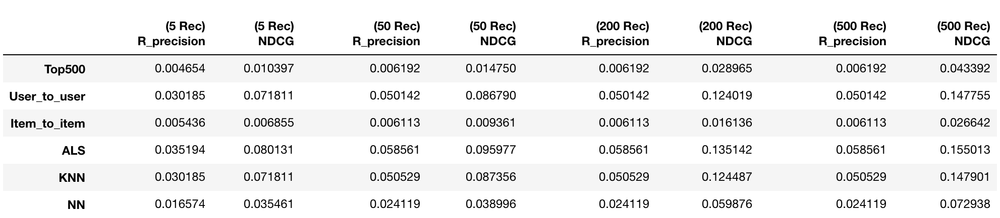
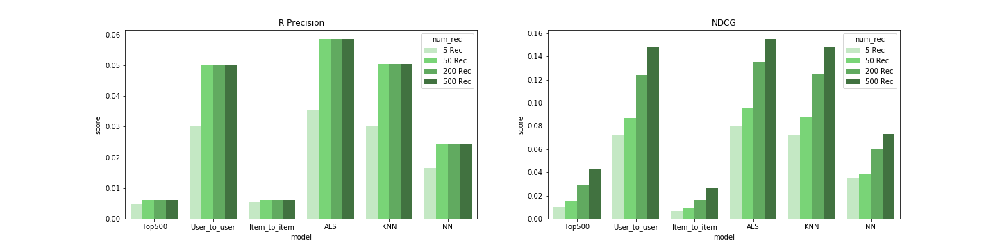
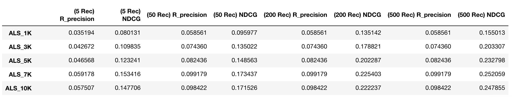
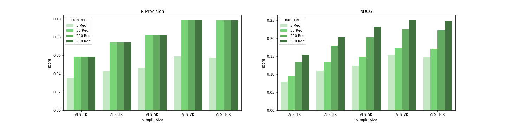

## Contents
{:.no_toc}
*  
{: toc}

## Results

### Model Comparisons

#### Overall performance

When we evaluated all of our recommendation models by looking at R precision, the ALS model had the best performance. User-based collaborative filtering and KNN yielded similar level of performance followed by NN with slightly lower R precision score. The item-based collaborative filtering generated the worst R precision score which was almost the same as our baseline recommendation model. When we assessed our models by NDCG score, ALS, user-based, and KNN models had similar high performance in recommending new songs to users followed by NN with lower NDCG score. Item-based model still generated worst performance. As we evaluated our models' performance by number of  recommendations, we found that the performance were better for all models when we recommended more songs. However, the performance did eventually reach a bottleneck when we evaluated by R precision, but continued to increase when we evaluated by NDCG.

#### Performance statistics

The best performancing model - the ALS model yielded an R precision score of 0.0586, and NDCG score of 0.1550. The User-based and KNN models also performed relatively well, yielding R precision scores of 0.0501 and 0.0505, and NDCG scores of 0.1478 and 0.1479. The NN model had a relatively poor performance but still managed to outperform the baseline model. The item-based model yielded the worst R precision and NDCG scores, both worse than the baseline model. 

#### Time efficiency

Simple recommender is non-personalized and thus we only compute the most popular tracks for one time. Memory-based approaches, both item-based and user-based, are slower and requires more memory, comparing to all model-based methods, ALS, k-NN and neural networks.

#### More on ALS

As can be seen in the figure above, as the sample size of the dataset used in building the model increases, the accuracy of the recommendation increases under both of the evaluation methods in general. 

Looking at the ALS model, we increased the range of the number of songs recommended to see if there is further influence on the model performance. Similar with previous findings among all models, when the model recommended more than 50 songs, further increasing the number of songs recommended no longer affected the R precision scores, but still increased the NDCG scores. This may be because of the fact that some correct recommendations appeared in the rear end of the recommendation lists.

## Conclusion

Based on the Million Player Dataset, we successfully built five music recommenders with five different collaborative filtering methods. Two of which are memory-based and the others are model-based. All models except for the item-to-item memory-based model outperformed the baseline model. Our best performing model, the ALS model, produced the highest R precision score of 0.0586 as well as the highest NDCG score of 0.1550 among all five recommenders.

Our winner, the ALS model, takes a large matrix of user-item interactions and figure out the ‘latent features’ that relate them to each other in a much smaller matrix of user features and item features through matrix factorization. It is also fast since the process can be parallelized.

The lacking performance of the item-to-item CF model might result from the high-dimensionality of the item-item similarity matrix. The interaction vectors of songs were very sparse since we only had 1K users for over 50K items. Thus the cosine distance would be unreliable due to the “curse of dimensionality”. Meanwhile, the user-based model was more dense and thus had a much better performance.

The memory-based models suffered from their demands on computational power. The dimension of similarity matrices grew quickly as the number of playlists increased and thus limited their scalability. Thus, model-based approach were used for better efficiency.

The performance of the ALS models depended on the number of factors we chose as well as some other parameters. When building the ALS models, we randomly selected numbers for certain factors and parameters, but it would be more reasonable to tune the parameters systematically. Also, a deeper exploration of the dataset would be helpful. The performance of the ALS model based on 10,000 playlists was worse than that of the 7,000 playlists. This could have resulted from the usage of non-ideal parameters. The performance of the ALS model may also have a limit; the combined usage of this model with other models may yielded better results.

Comparing with matrix factorization methods, neural networks with embeddings layers have more flexible architecture and thus can capture the latent factors of users’ and items’ properties in different ways. We used this model to make recommendations by predicting the probabilities of playlist-song pairs. The model’s performance is not as good as other model-based methods. One possible explanation is the architecture of our NN model is not good enough. Also, we could try another method of recommendation: utilize the weights of the embedding layers’ as the similarities of users’ and items’ vectors and thus recommend the songs with highest similarities. 

## Future Works

1. Due to our limited computational power on our personal computers, we could only build our models on a small subset of the data. To scale up for more samples and thus build a stronger model, we need to utilize cloud computing resources like AWS or Google Cloud Platform.
2. Our methods are all collaborative filtering, which is commonly used in real world but have significant drawbacks like cold start problem. To deal with issues like this, we may build hybrid models to utilize advantages of other types of models like content-based model, which is based on the feature data of the tracks. The feature data included in the MPD and features available from other datasets is needed. Features include but are not limited to: artist, music genre, music length, artist name, etc.
3. We hope that our work is the start of something big. We will continue on our path to seek more knowledge, discover more models and approaches to improve our automatic playlist recommender and lay the foundation for more amazing creations with our knowledge of data science.

## References

Benfred. (2018, November 26). Benfred/implicit. Retrieved from https://github.com/benfred/implicit/

Collaborative Filtering with Python. (n.d.). Retrieved from http://www.salemmarafi.com/code/collaborative-filtering-with-python/

GIS-T 2018 Proceedings – Transportation.org. (n.d.). Retrieved from <https://gis-t-dev.transportation.org/gis-t-2018-proceedings/>

Grover, P. (2017, December 28). Various Implementations of Collaborative Filtering – Towards Data Science. Retrieved from <https://towardsdatascience.com/various-implementations-of-collaborative-filtering-100385c6dfe0>

(n.d.). Retrieved from http://www.ccs.neu.edu/home/ekanou/ISU535.09X2/Handouts/Review_Material/

Rosenthal, E. (n.d.). Services. Retrieved from https://www.ethanrosenthal.com/2015/11/02/intro-to-collaborative-filtering/

Sklearn.neighbors.NearestNeighbors¶. (n.d.). Retrieved from https://scikit-learn.org/stable/modules/generated/sklearn.neighbors.NearestNeighbors.html

Zhou Y., Wilkinson D., Schreiber R., Pan R. (2008) Large-Scale Parallel Collaborative Filtering for the Netflix Prize. In: Fleischer R., Xu J. (eds) Algorithmic Aspects in Information and Management. AAIM 2008. Lecture Notes in Computer Science, vol 5034. Springer, Berlin, Heidelberg
