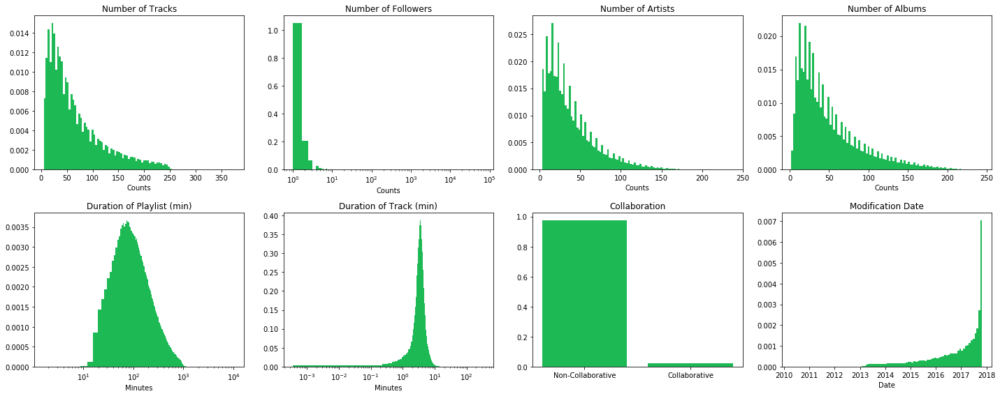

## Contents
{:.no_toc}
*  
{: toc}


## Data Preprocessing

We worked with the Million Playlist Dataset (MPD). The decompressed MPD’s size is 33.54 GB. The dataset consists of 1000 splits, each split contains 1000 playlists. Each playlist is a dictionary, which contains N ‘sub-dictionaries’ (N is the number of tracks in the playlist). Each ‘sub-dictionary’ contains detailed information on each track, with each piece of information being a key-value pair. 

To parse the dataset into a more structured format and to query more efficiently, we built a relational database by SQLite3 in Python. The schema of the database is shown in the figure below. The database was organized to three relational tables, storing information of playlists’ properties (`playlist_info`), tracks’ properties (`track_info`) and playlist-track information (`playlist`), respectively. Since we focused on the playlists here, the playlist’s ID (pid) is used as primary key in our the database (Fig. 1). To retrieve and query data from the database, SQL commands were used.

<center>Figure 1. Database Schema</center>


## The Million Playlist Dataset
### Part 1: Summary Statistics

There are 1,000,000 playlists in the MPD, among which 52 songs were found to have length equal to or less than 0 minute. After excluding those abnormal observations, there are 2,262,240 unique tracks, 287,737 distinct artists, and 571,611 distinct albums in this dataset. The median length of each song is 3.75 minutes. The median of total durations for each playlist is 190.37 minutes. 


```python
des
```


<div>
<style scoped>
    .dataframe tbody tr th:only-of-type {
        vertical-align: middle;
    }

    .dataframe tbody tr th {
        vertical-align: top;
    }
    
    .dataframe thead th {
        text-align: right;
    }
</style>
<table border="1" class="dataframe">
  <thead>
    <tr style="text-align: right;">
      <th></th>
      <th>count</th>
      <th>mean</th>
      <th>std</th>
      <th>min</th>
      <th>25%</th>
      <th>50%</th>
      <th>75%</th>
      <th>max</th>
    </tr>
  </thead>
  <tbody>
    <tr>
      <th>Number of Tracks</th>
      <td>1000000.0</td>
      <td>66.346428</td>
      <td>53.669358</td>
      <td>5.000000</td>
      <td>26.000000</td>
      <td>49.000000</td>
      <td>92.000000</td>
      <td>376.000000</td>
    </tr>
    <tr>
      <th>Number of Followers</th>
      <td>1000000.0</td>
      <td>2.597746</td>
      <td>128.851145</td>
      <td>1.000000</td>
      <td>1.000000</td>
      <td>1.000000</td>
      <td>1.000000</td>
      <td>71643.000000</td>
    </tr>
    <tr>
      <th>Number of Artists</th>
      <td>1000000.0</td>
      <td>38.088211</td>
      <td>30.282901</td>
      <td>3.000000</td>
      <td>16.000000</td>
      <td>29.000000</td>
      <td>52.000000</td>
      <td>238.000000</td>
    </tr>
    <tr>
      <th>Number of Albums</th>
      <td>1000000.0</td>
      <td>49.597278</td>
      <td>39.961064</td>
      <td>2.000000</td>
      <td>20.000000</td>
      <td>37.000000</td>
      <td>68.000000</td>
      <td>244.000000</td>
    </tr>
    <tr>
      <th>Duration of Playlist (min)</th>
      <td>1000000.0</td>
      <td>259.661281</td>
      <td>214.273910</td>
      <td>1.625633</td>
      <td>99.923050</td>
      <td>190.373967</td>
      <td>357.228129</td>
      <td>10584.563200</td>
    </tr>
    <tr>
      <th>Duration of Track (min)</th>
      <td>2262240.0</td>
      <td>4.129023</td>
      <td>2.794452</td>
      <td>0.000367</td>
      <td>3.071333</td>
      <td>3.754667</td>
      <td>4.638433</td>
      <td>345.742917</td>
    </tr>
  </tbody>
</table>
</div>


<center>Figure 2. Distribution of Summary Statistics</center>



The median of total durations for each playlist is 190.37 minutes. The distributions of number of tracks, number of artists, and number of albums for each playlist are right skewed. Thus, median values provide better descriptions than mean values for these features. The median of number of tracks in each playlist is 49, whereas the longest playlist contains 376 songs, and the shortest playlist has only 5 songs. In addition, about 50% of the playlists contain songs from over 29 artists or songs from over 37 albums. The majority of the playlists were built non-collaboratively. Furthermore, most of the changes in those playlists were made recently with the latest modification made on November 1 in 2017. 

### Part 2: Popularity of tracks, artists and albums

The popularity of tracks, artists and albums might be useful for recommendation - the most simple and intuitive method of recommendation is to recommend the most popular tracks to users. Thus, we listed top 50 tracks, artists and albums in the whole MPD, which is useful for future references. 

<center>Figure 3. The most popular tracks, artists and albums</center>


## Taking a subset for modeling

Due to the limited computation power of local PC, we randomly sampled a small subset of playlists (1000 playlists) to work with different recommendation algorithms (even computationally intensive ones). To see whether the small dataset's composition is comparable with MPD's, we repeated the same EDA process on it. The distribution of summary statistics of playlists and the popularity is similar to MPD, though the magnitude is different due to different sample size. Even the top songs is very similar to both datasets.  

>Number of playlists in total: 1000   
Number of tracks in total: 61163    
Number of unique tracks: 33661    
Number of unique artists: 9858   
Number of unique albums: 17345   
Number of unique titles: 869    

<center>Figure 4. Distribution of Summary Stats for 1000 playlists</center>


<center>Figure 5. The most popular tracks, artists and albums</center>


