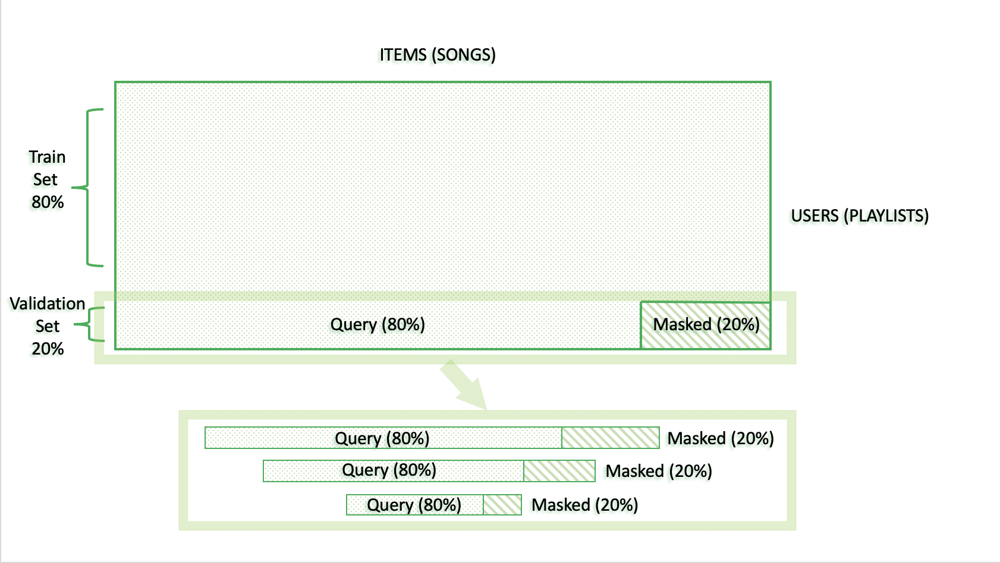
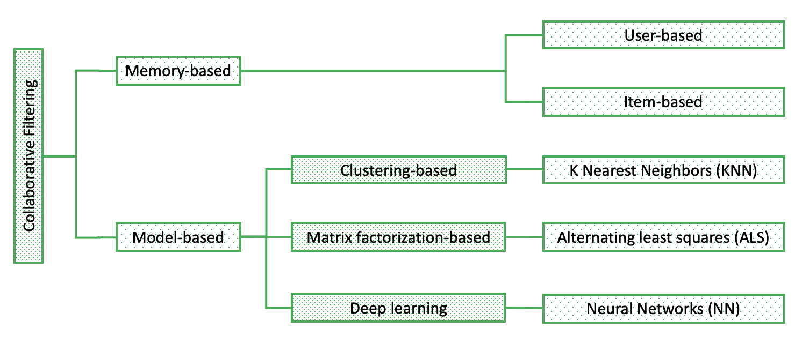
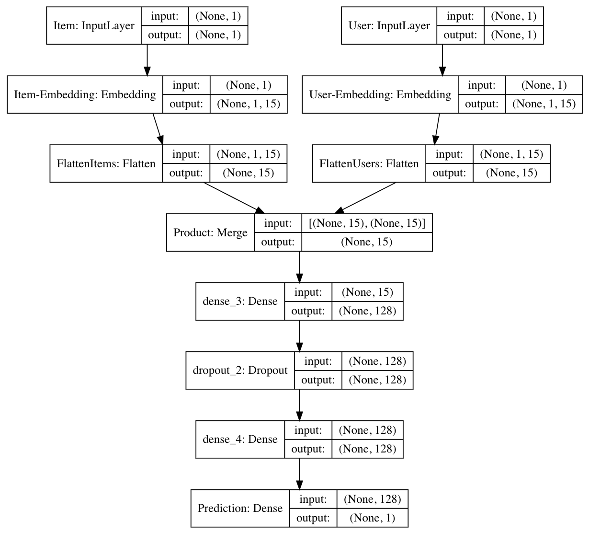

## Contents
{:.no_toc}
*  
{: toc}

## Train and Validation Set

Having taken a subset of 1000 playlists, we first built up a train-validation set for building and choosing models. First, we splits 1000 playlists into train playlists (80%) and validation playlists (20%). For those validation playlists, since our goal is to recommend new songs based on prior playlists entries, we would holdout the 20% entries of each playlists. For example, for a 50-track long playlists, 40 songs were used to train the model, and left 10 songs would be masked to evaluate the recommendations of the model. 

## Metrics

1. **R-Precision**

   We used two kinds of methods in evaluating the accuracy of the recommendations, which were R-precision and NDCG(Normalized discounted cumulative gain). These two methods are different in two ways, which are how they deal with the length and position of recommendations.

   R-precision is the number of retrieved relevant tracks divided by the number of known relevant tracks (i.e., the number of withheld tracks):

   (The ground truth set of tracks by G, and the ordered list of recommended tracks by R.)
   $$
   R-precision = \frac{|G\cap R_{1:|G|}|}{|G|}
   $$

2. **NDCG** (Normalized DCG (NDCG))

   In our case, this method only takes some first recommendations into account, with the length equals to that of the masked tracks. And it does not treat the position of the correct recommendations differently.

   Discounted cumulative gain (DCG) measures the ranking quality of the recommended tracks, increasing when relevant tracks are placed higher in the list. Normalized DCG (NDCG) is determined by calculating the DCG and dividing it by the ideal DCG in which the recommended tracks are perfectly ranked:
   $$
   DCG = rel_1 + \sum_{i=2}^{|R|}\frac{rel_i}{log_2(i+1)}
   $$

   $$
   IDCG=1+\sum^{G\cap R}_{i=2}\frac{1}{log_2(i+1)}
   $$

   $$
   NDCG=\frac{DCG}{IDCG}
   $$

   In our case, the ideal DCG should be calculated as when all the correct tracks are recommended at the first several places. This method takes the position into account, in practise, correct recommendations at some bottom places will be weighted pretty low. And as the number of recommendations considered increases, more recommendations will be considered, not like R-precision, which only considers a length that is equal to the known tracks.

## Modeling Approach

### Baseline Model

To compare the performance of more advanced recommenders, we built a simple, non-personalized recommender as the baseline model. It will recommend same songs for all users, regardless of the users' and items' properties. Thus, we will simply recommend songs by poplarity: recommend 500 most popular songs of whole MPD. 

### Collaborative Filtering

Collaborative filtering is a common technique for recommendation systems. It is based on the assumption that people will like items that are similar to other items they like, and people will like items that are liked by other similar people. There are two types of collaborative filtering models, which are memory-based and model-based collaborative filtering. Memory-based approaches establish similarity matrix between either items or users, whereas model-based approaches further fill out the matrix with several machine learning algorithms to predict how likely a new item will be picked by a user. In our case, `user` and `playlist` were used interchangeably, and `item` and `song/tracks` were used interchangeably.

#### Memory-based Approach

##### Item-based

We created a cosine similarity matrix between each playlist in train dataset. When we did recommendations for a specific playlist, we looked at each new song that was not currently in this playlist and all other playlists including that new song. We added the user-to-user similarities for those playlists to generate a new similarity score and ranked all new songs by this new similarity. Then we recommended 500 songs for each playlist based on this new similarity score. Instead of simply equally recommending all songs from a similar user, this approach enabled us to generate rank for each new song recommended.

##### User-based

For our item-to-item model, we first created a cosine similarity matrix between each item (song) in the train dataset (of the 1000-playlists subset). This resulted in a similarity matrix of size 32643 * 32643. Using the similarity matrix, the top 700 neighbors (top 700 most similar songs) of each song were found and put into a Pandas DataFrame of size 32643 * 700. Next, for each input song, we retrieved its neighbors and compiled them together into a 1-d numpy array. After removing all repetitive songs and songs that are in the input playlist, we recommended the songs with the top 500 similarity scores.

#### Model-based Approach

##### KNN

The nearest neighbors model is a unsupervised learner for neighbor searches. It can compute the distance between every interaction vector in the query set against every interaction vector in the reference set. Particularly, in our approach, we made recommendation based on playlists, using the train playlists as the reference set. We computed the distance between every query playlists and return the $k$ closest reference playlists. Various types of dissimilarity metrics is available in sklearn package. Since we only have binary entries in the vector, cosine dissimilarity was used. 

Based on the returned similarites and closest neighbours, we made recommendations by averaging the similarities of interaction vectors for each song. In other words, we calculated the averaged similarity of playlists which contained the song for every song. The results were then used to provide a ranking of all songs for each playlist.

##### ALS

We here chose ALS for our implicit data, which has no ranking for the items, in many of matrix factorization methods. ALS factors the “playlists by songs” matrix into smaller matrices. The product of those lower dimensional matrices equals the original one, and those small matrices include hidden features that we learn from data. We carried out the model using python package implicit 0.3.8. The factors set to learn for 1,000 playlist is 50, with the regularization factor set to be 0.01, the linear scaling factor set as the rate of which the confidence increases is 30, under 20 iterations.

As ALS appeared to be quick, also built extra models using larger datasets, which included 3,000, 5,000, 7,000, and 10,000 playlists. The parameters used to built the models mostly remain the same, except for the number of factors, we multiplied the original number by the times of the playlist length to 1,000. 

##### NN

Neural networks can also be used to capture the latent factors to represent items' and users' features, which is similar to matrix factorization methods. This is implemented by adding embedding layers for the item inputs and user inputs. The architecture of our NN is given in the figure below. It would be trained on positive observations (pairs of user-item) and randomly generated negative observations (user-item pairs not in train dataset). Then, we used the fitted neural networks to predict the probability of being positive observations, given pairs of user and their unlistened songs and gave the recommendations based on the ranking of the probabilities. Generally, neural networks will perform good when predict ratings, and also have reasonable performance on making recommendations.

